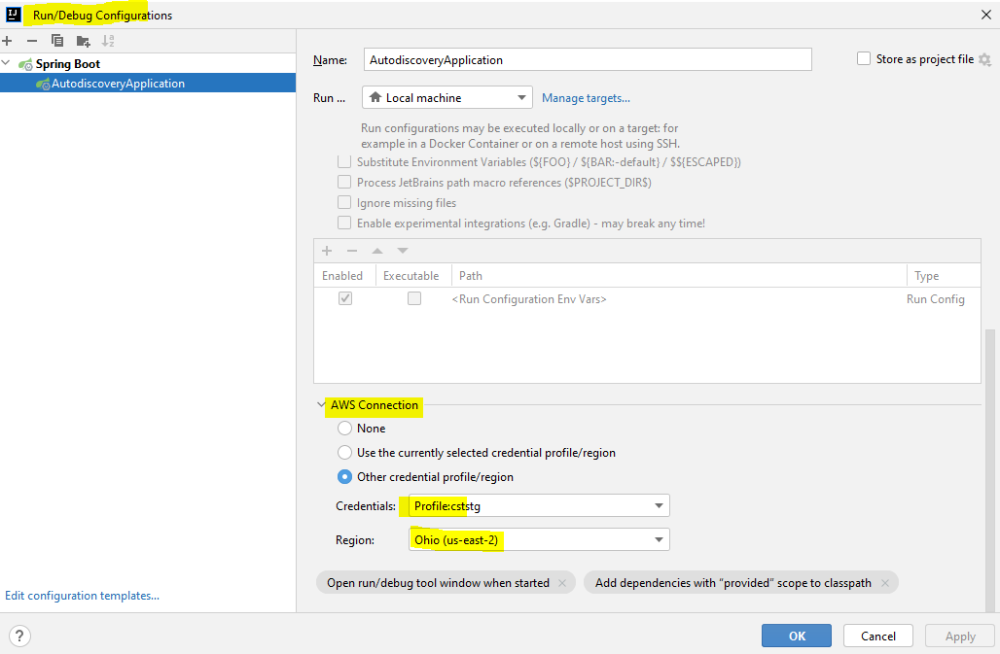

# Objectives
- Boot time discovery of aurora rds global cluster based on cluster id
- Regional proximity for reads and fallback to primary region reader if unavailable
- Healthchecks for auto discoverying topology changes

# Core Concept


# Prequisites
- The process needs to be tied to roles that can perfrom the following AWS API calls
  - `aws rds describe-global-cluster`
  - `aws rds describe-db-cluster-endpoints`
- Plugin required environment variables for datasource credentials

# Required environment variables
```shell
AUTODISCOVERY_DATASOURCE_GLOBALCLUSTERID=aws-global-db-cluster-id-value
AUTODISCOVERY_DATASOURCE_CLIENTAPPREGION=us-east-2
AUTODISCOVERY_DATASOURCE_NAME=postgres
AUTODISCOVERY_DATASOURCE_PORT=5432
AUTODISCOVERY_DATASOURCE_USERNAME=***
AUTODISCOVERY_DATASOURCE_PASSWORD=***
```

# Running in intellij
Intellij process can be tied to an AWS profile that allows for execution of describing global cluster 
and cluster endpoint inspection commands. In order to configure this you will need to install `AWS Toolkit` Plugin. Once
the plugin is installed execute the following steps:

- Add profiles in your ~/.aws/config file that has access to database and aws API
```shell
Sample ~/.aws/config
[default]
region=us-east-2
output=json

[profile aws-test-account-poweruser]
source_profile=default
role_arn=arn:aws:iam::627915540598:role/vtx-PowerUser
mfa_serial=arn:aws:iam::776380148969:mfa/Sanjeev.Giri@vertexinc.com
```
- Ensure that the credentials for the default profile or any other inherited profile
is included `~/.aws/credentials` file.
- Open AWS Toolkit plugin widged by navigating to `view>tools>AWS Toolkit`
- On the AWS toolkit widget, enable aws connection to java runtime by checking `settings cog > Experimental Featuers > AWS Connected to Java Run Configurations`
- On the Application debug/run configuration ensure desired profile is selected.


# Running as a container in AppRunner or K8s Cluster
- Build docker image by executing the following command
```shell
mvn clean package -Pdocker
```
- Ensure that the docker container process is associated to a profile or service account that allows connectivity to 
RDS cluster and AWS RDS APIs

