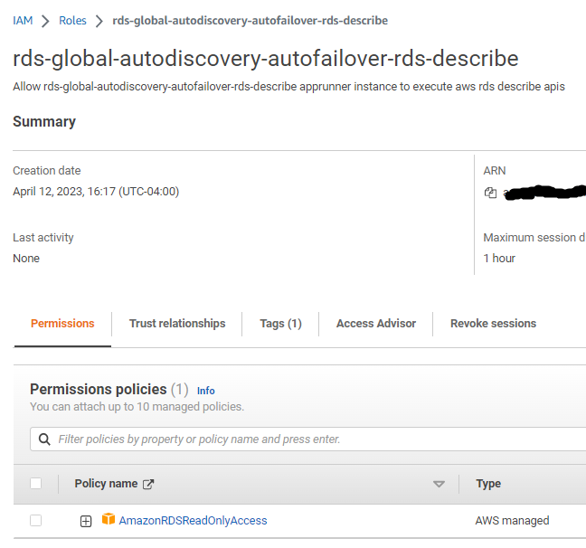
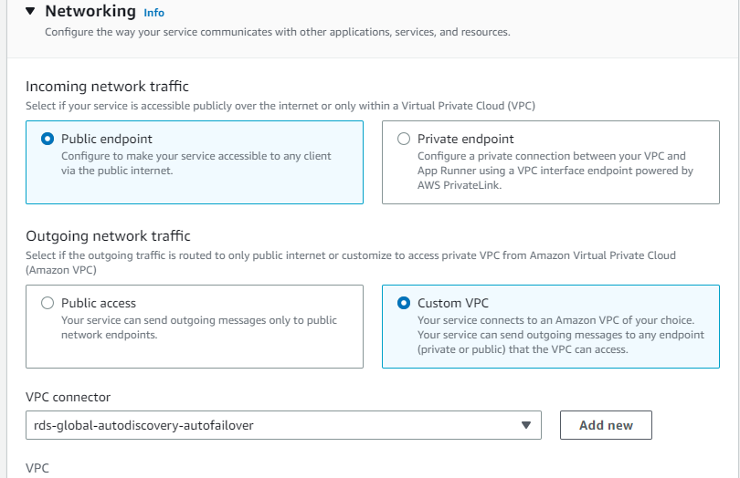

# Objectives
- Boot time discovery of aurora rds global cluster based on cluster id
- Regional proximity for reads and fallback to primary region reader if unavailable
- Healthchecks for auto discoverying topology changes

# Core Concept


# Prequisites
- The process needs to be tied to roles that can perfrom the following AWS API calls
  - `aws rds describe-global-cluster`
  - `aws rds describe-db-cluster-endpoints`
  - `aws rds delete-global-cluster`
  - `aws rds describe-db-cluster`
  - `aws rds create-global-cluster`
- Configure required environment variables for datasource credentials

# Need for deletion, and creation
In case of disaster, the global cluster can be pushed into a state where it becomes memberless. During that time the 
application cluster is expected to fail as a result of liveness check failures (healthcheck). At boot up time this specific
implementation attempts to reconfigure memberless global cluster for which following actions are required:
- Deletion of old memberless global cluster
- Creation of new global cluster with same global cluster id

# Required environment variables
```shell
AUTODISCOVERY_DATASOURCE_GLOBALCLUSTERID=aws-global-db-cluster-id-value
AUTODISCOVERY_DATASOURCE_GLOBALMEMBERLESSCLUSTERPREFERREDWRITER=regional-rds-cluster-id-for-region-defined-in-client-app-region
AUTODISCOVERY_DATASOURCE_CLIENTAPPREGION=us-east-2
AUTODISCOVERY_DATASOURCE_NAME=postgres
AUTODISCOVERY_DATASOURCE_PORT=5432
AUTODISCOVERY_DATASOURCE_USERNAME=***
AUTODISCOVERY_DATASOURCE_PASSWORD=***
```

# Running in intellij
Intellij process can be tied to an AWS profile that allows for execution of describing global cluster 
and cluster endpoint inspection commands. In order to configure this you will need to install `AWS Toolkit` Plugin. Once
the plugin is installed execute the following steps:

- Add profiles in your ~/.aws/config file that has access to database and aws API
```shell
Sample ~/.aws/config
[default]
region=us-east-2
output=json

[profile aws-test-account-poweruser]
source_profile=default
role_arn=arn:aws:iam::****:role/roleName
mfa_serial=arn:aws:iam::****:mfa/***@***.com
```
- Ensure that the credentials for the default profile or any other inherited profile
is included `~/.aws/credentials` file.
- Open AWS Toolkit plugin widged by navigating to `view>tools>AWS Toolkit`
- On the AWS toolkit widget, enable aws connection to java runtime by checking `settings cog > Experimental Featuers > AWS Connected to Java Run Configurations`
- On the Application debug/run configuration ensure desired profile is selected.


# Running as a container in AppRunner

- Build docker image by executing the following command
```shell
mvn clean package -Pdocker
```
- Create an IAM role with permissions to access AWS RDS describe* APIs

**I used a predefined policy as an example. For production usage please trim it down to the following:**
```shell
DescribeGlobalClusters
DescribeDBClusterEndpoints
DeleteGlobalCluster
```
- Update the role trust relationship to allow app runner to assume the role


- Create an apprunner instance using the docker image, and permissions.




# Running as a Kubernetes Container
Ensure that the k8s deployment is tied to a IAM Role as a Service Account (IRSA) with neccessary policies 
to `DescribeGlobalClusters` and `DescribeDBClusterEndpoints`

# Reference AWS Commands Used
```shell

# Get global cluster
aws rds describe-global-clusters --global-cluster-identifier global-cluster-id

# Get global cluster
aws rds describe-db-cluster-endpoints --db-cluster-identifier cluster-id-name --region us-east-2
aws rds describe-db-cluster-endpoints --db-cluster-identifier cluster-id-name --region us-west-2

# Delete memberless global cluster
aws rds delete-global-cluster --global-cluster-identifier global-cluster-id

# Get preferred regional cluster writer for global cluster attachment
aws rds describe-db-clusters --db-cluster-identifier cluster-id --region us-east-2

# Create global cluster with preferred regional cluster as writer
aws rds create-global-cluster --global-cluster-identifier global-cluster-id \
--source-db-cluster-identifier `aws rds describe-db-clusters --db-cluster-identifier cluster-id --region us-east-2 \
--query "*[].[DBClusterArn]" --output text` \
--region us-east-2
```